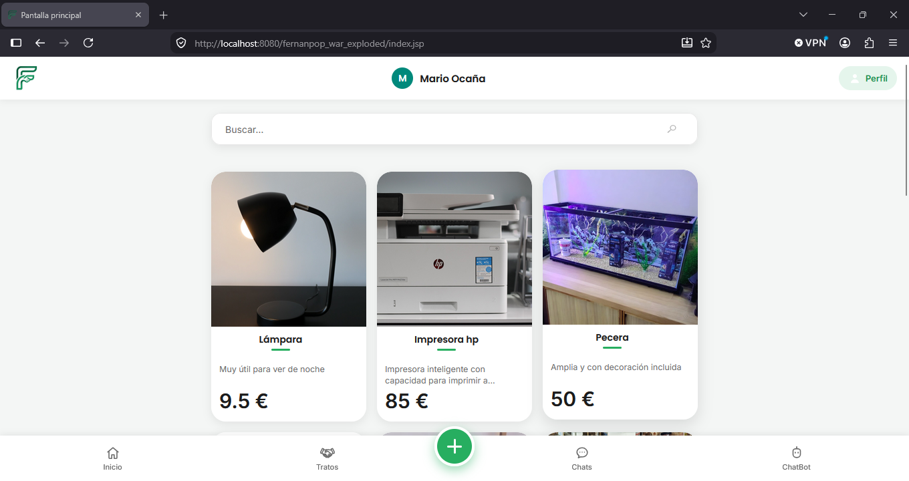
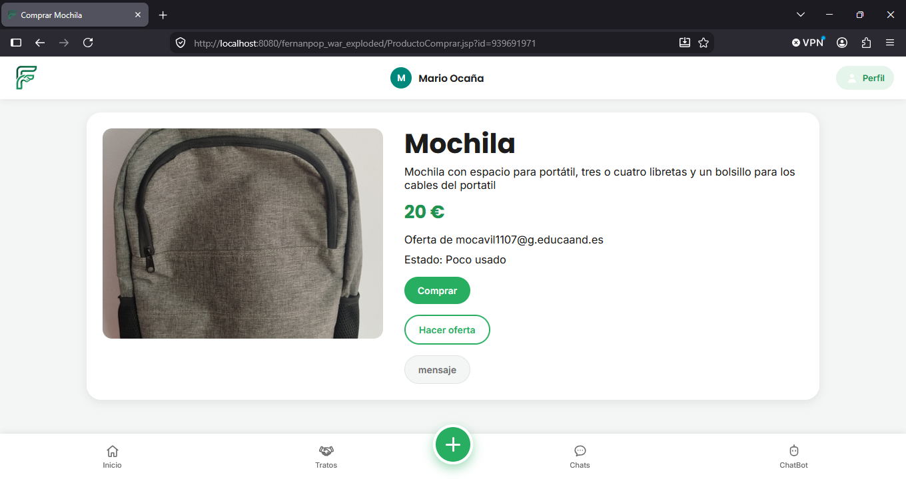
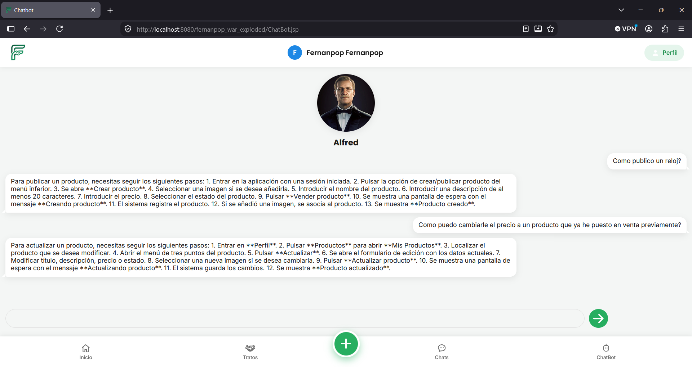
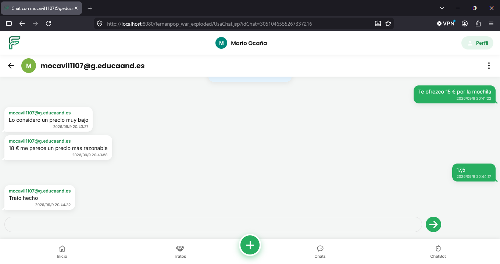
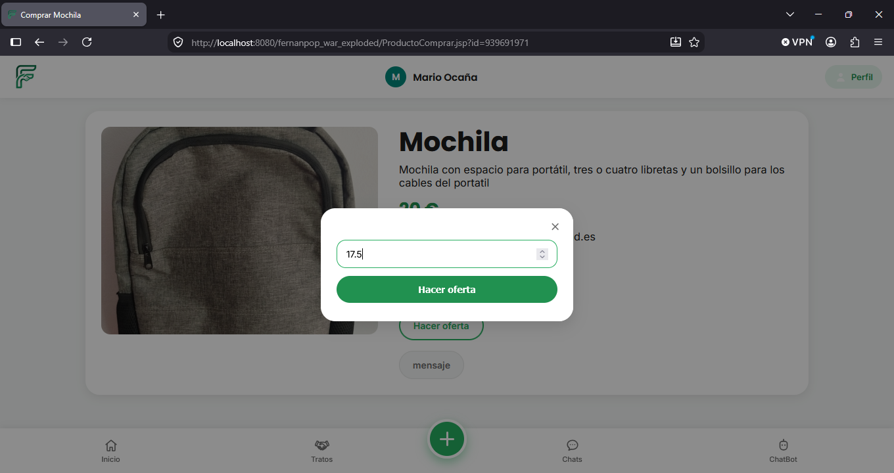
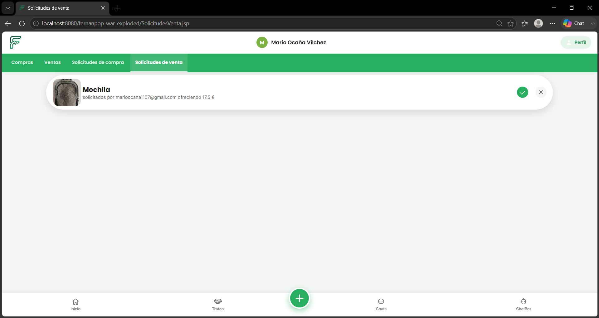
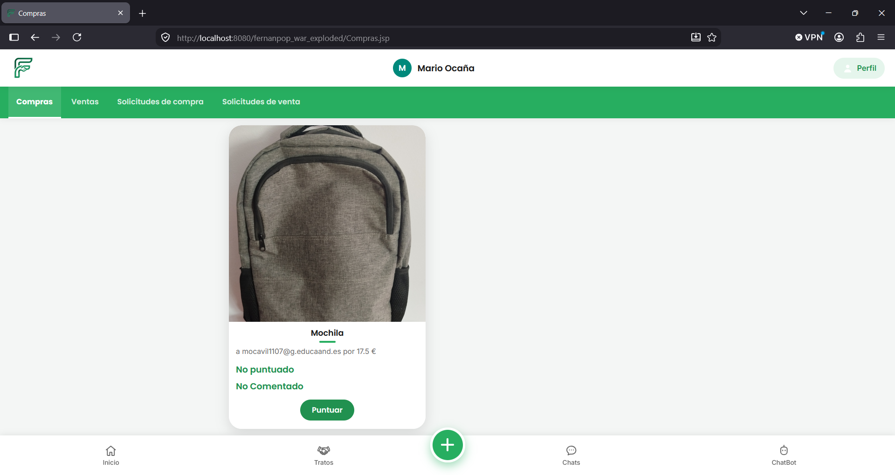
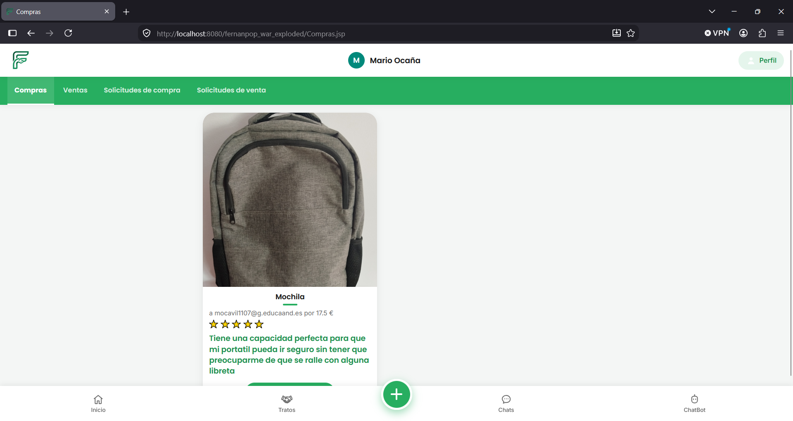

# 🛍️ Fernanpop

> **Plataforma de compra y venta de artículos de segunda mano entre usuarios.**

**Fernanpop** es una aplicación web desarrollada con **Java/JSP, HTML, CSS, JavaScript y MySQL** que permite a los usuarios publicar, buscar, comprar y vender artículos de segunda mano.

El proyecto incorpora además funcionalidades de **mensajería privada**, **valoración de usuarios** y un **asistente virtual basado en Inteligencia Artificial**, utilizando **Llama 3.1**, servido mediante **Ollama** e integrado en la aplicación a través de **AnythingLLM**.

La arquitectura está orientada a una aplicación web tradicional Java/Jakarta EE empaquetada como `WAR`, con acceso a base de datos MySQL mediante JDBC.

---

## 📸 Capturas de Pantalla


| Vista                              | Captura                                                         |
|------------------------------------| --------------------------------------------------------------- |
| 🏠 Pantalla principal              |             |
| 🛒 Detalle de producto             |         |
| 🤖 Chatbot IA                      |      |
| 💬 Chat entre usuarios             |          |
| ⭐ Solicitud de compra              |  |
| ⭐ Aceptar solicitud                |  |
| ⭐ Antes de añadir una valoración   |  |
| ⭐ despues de añadir una valoración |  |


---

## ✨ Características Principales

### 🛒 1. Gestión de productos

Fernanpop proporciona un sistema completo para gestionar artículos de segunda mano:

* 📦 Publicación de nuevos productos.
* ✏️ Edición de productos publicados.
* 🗑️ Eliminación de productos.
* 🖼️ Subida y gestión de imágenes.
* 🔎 Búsqueda y filtrado de artículos.
* 💰 Gestión de precios.
* 📋 Catálogo de productos disponibles.
* 🤝 Gestión del proceso de compra y venta.
* 📜 Historial de compras y ventas.

Cada producto está asociado a un usuario y dispone de información como título, descripción, precio y estado.

---

### ⭐ 2. Sistema de valoración

Después de completar una transacción, los usuarios pueden valorar su experiencia.

El sistema permite:

* ⭐ Asignar una puntuación.
* 💬 Añadir comentarios o reseñas.
* 📊 Mantener un historial de valoraciones.
* 🔔 Gestionar valoraciones pendientes después de una compra.

Este mecanismo ayuda a crear un entorno de confianza entre compradores y vendedores.

---

### 🤖 3. Alfred — Asistente virtual con Inteligencia Artificial

**Alfred** es el asistente virtual inteligente integrado en Fernanpop, basado en **Llama 3.1** y servido mediante **Ollama**, con **AnythingLLM** como capa de integración.

Alfred está diseñado para ofrecer dos funcionalidades principales:

#### 💬 Resolver dudas sobre Fernanpop

El usuario puede realizar preguntas relacionadas con el funcionamiento de la plataforma, por ejemplo:

* ❓ Cómo comprar un producto.
* 📦 Cómo publicar un artículo.
* ⭐ Cómo funcionan las valoraciones.
* 💬 Cómo utilizar el sistema de mensajería.
* 👤 Cómo gestionar el perfil.
* 🛒 Cómo consultar compras o ventas.
* 🔎 Cómo encontrar determinados productos.

Alfred interpreta la consulta y proporciona una respuesta utilizando el contexto y la información disponible para ayudar al usuario a utilizar la aplicación.

#### 🔎 Buscar productos por el usuario

Una de las funcionalidades más destacadas de Alfred es su capacidad para **buscar productos mediante lenguaje natural**.

El usuario puede realizar una petición como:

> *"Busca bicicletas de montaña por menos de 500 €."*

En lugar de obligar al usuario a utilizar manualmente los filtros de búsqueda, Alfred interpreta la petición y puede **generar una consulta SQL** adaptada a los criterios solicitados.

El flujo de búsqueda es:

```text
Usuario
   │
   │ "Busca bicicletas de montaña por menos de 500 €"
   ▼
┌─────────────────────┐
│       Alfred        │
│     Llama 3.1       │
└──────────┬──────────┘
           │
           │ Genera consulta SQL
           ▼
┌─────────────────────┐
│    Aplicación       │
│  Valida / adapta    │
│      la consulta    │
└──────────┬──────────┘
           │
           │ SQL
           ▼
┌─────────────────────┐
│       MySQL         │
└──────────┬──────────┘
           │
           │ Resultados
           ▼
┌─────────────────────┐
│   Página principal  │
│   muestra productos │
└─────────────────────┘
```

Antes de ejecutar la consulta generada por la Inteligencia Artificial, la aplicación **añade y aplica restricciones específicas de negocio y seguridad**. Por ejemplo, evitar que aparezcan productos publicados por el propio usuario que realiza la búsqueda.

De esta forma, Alfred actúa como una interfaz de búsqueda basada en lenguaje natural, permitiendo realizar consultas más intuitivas sin que el usuario tenga que conocer los filtros o la estructura de la base de datos.

> 🔐 **Importante:** Alfred no ejecuta directamente cualquier SQL generado por el modelo. La aplicación es responsable de procesar, validar y adaptar la consulta antes de enviarla a la base de datos.

### 🧠 Arquitectura de Alfred

La integración utiliza los siguientes componentes:

```text
┌─────────────────────┐
│      Fernanpop      │
│       JSP/Java      │
└──────────┬──────────┘
           │
           │ HTTP API
           ▼
┌─────────────────────┐
│     AnythingLLM     │
│ Gestión del contexto│
└──────────┬──────────┘
           │
           ▼
┌─────────────────────┐
│       Ollama        │
│      Llama 3.1      │
└─────────────────────┘
```

La aplicación se comunica con AnythingLLM mediante una petición HTTP autenticada.

El proyecto utiliza los siguientes parámetros para configurar la conexión:

* `apiKeyIA` → API Key utilizada para autenticarse.
* `rutaIA` → URL del endpoint de AnythingLLM.

La comunicación con el servicio de Inteligencia Artificial se gestiona desde:

```text
Controller/GestionAPP.java
```

La respuesta obtenida se procesa desde Java y se muestra posteriormente en la página principal.


### 💬 4. Mensajería instantánea

Los usuarios pueden comunicarse directamente entre compradores y vendedores.

El sistema permite:

* 💬 Crear conversaciones privadas.
* ✉️ Enviar mensajes.
* ✏️ Editar mensajes.
* 🗑️ Eliminar mensajes.
* 👥 Gestionar conversaciones entre usuarios.
* 🔔 Controlar mensajes pendientes de lectura.
* 🚫 Bloquear/desbloquear usuarios.
* 📜 Consultar el historial de conversaciones.

Esta funcionalidad permite negociar condiciones de compra antes de completar una operación.

---

## 🧰 Stack Tecnológico

| Capa               | Tecnología            | Uso                                                      |
| ------------------ | --------------------- | -------------------------------------------------------- |
| 🖥️ Frontend       | HTML5                 | Estructura de las páginas                                |
| 🎨 Estilos         | CSS3                  | Diseño e interfaz                                        |
| ⚡ Cliente          | JavaScript            | Interactividad y peticiones                              |
| ☕ Backend          | Java                  | Lógica de negocio                                        |
| 🌐 Web             | JSP / Jakarta Servlet | Generación y gestión de páginas web                      |
| 🗄️ Base de datos  | MySQL                 | Persistencia de usuarios, productos, chats y operaciones |
| 🔌 Acceso a datos  | JDBC                  | Comunicación Java ↔ MySQL                                |
| 🔐 Seguridad       | BCrypt                | Hash y validación de contraseñas                         |
| 📄 Documentos      | Apache PDFBox         | Generación de documentos PDF                             |
| 📧 Comunicación    | Jakarta Mail          | Envío de correos electrónicos                            |
| 🤖 IA              | Llama 3.1             | Modelo de lenguaje                                       |
| 🧠 IA Runtime      | Ollama                | Ejecución local del modelo                               |
| 🔗 IA Gateway      | AnythingLLM           | Integración y gestión del chatbot                        |
| 📦 Build           | Maven                 | Compilación y empaquetado                                |

### Dependencias principales

El proyecto utiliza, entre otras:

* Jakarta Servlet API `6.1.0`
* MySQL Connector/J `9.6.0`
* Apache PDFBox `3.0.7`
* jBCrypt `0.4`
* Jakarta Mail `1.6.4`
* JSON `20251224`
* JUnit Jupiter `5.13.2`

El artefacto Maven se genera como:

```text
fernanpop-1.0-SNAPSHOT.war
```

---

# 🚀 Instalación

## 📋 Requisitos previos

Para ejecutar Fernanpop necesitarás:

* ☕ **JDK 26** o una versión compatible con la configuración del proyecto.
* 📦 **Apache Maven** o utilizar el Maven Wrapper incluido en el proyecto (`mvnw` / `mvnw.cmd`).
* 🐱 **Apache Tomcat 10.1.57**.
* 🗄️ **MySQL 8.x**.
* 🐳 **Docker** y **Docker Compose**, si se desea ejecutar MySQL mediante un contenedor.
* 🤖 **Ollama** para ejecutar Llama 3.1.
* 🧠 **AnythingLLM** para integrar el modelo de IA con Fernanpop.

> 💡 Maven se utiliza para **compilar y empaquetar** la aplicación. Tomcat se utiliza posteriormente para **ejecutar el archivo `.war` generado**.

---

## 🐳 1. Preparar MySQL con Docker

El código proporcionado contiene las clases DAO para MySQL, pero **no incluye actualmente un ****`Dockerfile`**** ni un ****`docker-compose.yml`**.

Una configuración de desarrollo puede utilizar un contenedor MySQL independiente:

```yaml
services:
  mysql:
    image: mysql:8.4
    container_name: fernanpop-mysql
    restart: unless-stopped

    environment:
      MYSQL_DATABASE: fernanpop
      MYSQL_USER: fernanpop
      MYSQL_PASSWORD: fernanpop
      MYSQL_ROOT_PASSWORD: change-me

    ports:
      - "3306:3306"

    volumes:
      - fernanpop_mysql_data:/var/lib/mysql

volumes:
  fernanpop_mysql_data:
```

Guarda esta configuración como:

```text
docker-compose.yml
```

Y levanta MySQL:

```bash
docker compose up -d mysql
```

Comprueba que el contenedor esté funcionando:

```bash
docker compose ps
```

---

## ☕ 2. Compilar el proyecto

Desde la raíz del proyecto:

### Linux / macOS

```bash
./mvnw clean package
```

### Windows

```powershell
.\mvnw.cmd clean package
```

También puedes utilizar Maven directamente:

```bash
mvn clean package
```

El resultado se generará dentro de:

```text
target/
└── fernanpop-1.0-SNAPSHOT.war
```

---

## 🌐 3. Desplegar la aplicación

Fernanpop se empaqueta como una aplicación `WAR`, por lo que debe desplegarse sobre un servidor Jakarta compatible con Servlet 6.1.

Una vez iniciado el servidor, copia:

```text
target/fernanpop-1.0-SNAPSHOT.war
```

al directorio de despliegue de tu servidor.

Por ejemplo:

```text
<servidor>/webapps/
```

La aplicación estará disponible normalmente mediante una URL similar a:

```text
http://localhost:8080/fernanpop-1.0-SNAPSHOT/
```

> ℹ️ La URL exacta depende del servidor y de su configuración.

---

# 🗄️ Configuración de MySQL

La aplicación utiliza una capa DAO para gestionar la persistencia:

```text
src/main/java/
└── Dao/
    ├── DaoUsuarioSQL.java
    ├── DaoProductoSQL.java
    ├── DaoChatSQL.java
    ├── DaoMensajeSQL.java
    ├── DaoTratoSQL.java
    └── DaoBloqueoSQL.java
```

Antes de ejecutar la aplicación debes asegurarte de que:

1. MySQL está iniciado.
2. La base de datos de Fernanpop existe.
3. Las tablas necesarias han sido creadas.
4. Las credenciales configuradas en la aplicación son correctas.
5. El servidor Java puede acceder al puerto de MySQL.

Ejemplo de conexión:

```text
Host: localhost
Puerto: 3306
Base de datos: fernanpop
Usuario: fernanpop
```

> ⚠️ No utilices estas credenciales de ejemplo en producción.

---
# 🤖 Configuración del Chatbot

Fernanpop utiliza tres componentes:

```text
Fernanpop
    │
    │ HTTP + API Key
    ▼
AnythingLLM
    │
    │ LLM Provider
    ▼
Ollama
    │
    ▼
Llama 3.1
```

## 1. Instalar Ollama

Instala Ollama siguiendo las instrucciones oficiales.

Después, descarga el modelo:

```bash
ollama pull llama3.1
```

Comprueba que Ollama responde correctamente:

```bash
ollama list
```

---

## 2. Configurar la temperatura del modelo

Para Fernanpop se recomienda utilizar una **temperatura de `0`** tanto en **Ollama** como en **AnythingLLM**.

```text
Temperature = 0
```

La finalidad es minimizar la aleatoriedad de las respuestas y conseguir un comportamiento lo más **determinista, preciso y reproducible** posible.

Esto es especialmente importante cuando el chatbot:

* 🧮 Resuelve operaciones o consultas matemáticas.
* 🗄️ Genera consultas SQL.
* 🔎 Realiza consultas sobre información estructurada.
* 🔧 Devuelve resultados que posteriormente serán procesados automáticamente por la aplicación.
* 📄 Debe respetar un formato de salida concreto.

### ¿Por qué utilizar temperatura 0?

Una temperatura elevada permite respuestas más variadas y creativas, pero puede provocar que el modelo:

* Añada explicaciones innecesarias.
* Cambie ligeramente una respuesta entre ejecuciones.
* Genere texto adicional alrededor de una consulta SQL.
* Introduzca información que no se encuentra en los datos proporcionados.
* Modifique el formato esperado por la aplicación.

En Fernanpop se prioriza **precisión y consistencia frente a creatividad**.

Por ello, la configuración recomendada es:

| Parámetro                    |                   Valor recomendado |
| ---------------------------- | ----------------------------------: |
| `Temperature` en Ollama      |                                 `0` |
| `Temperature` en AnythingLLM |                                 `0` |
| Modelo                       |                         `Llama 3.1` |
| Objetivo                     | Respuestas deterministas y precisas |

> ⚠️ **Nota:** una temperatura de `0` reduce la aleatoriedad, pero no elimina por sí sola las alucinaciones de un LLM. Para obtener respuestas fiables es igualmente importante utilizar un prompt adecuado, proporcionar contexto suficiente y validar las respuestas antes de utilizarlas automáticamente.

---

## 3. Configuración de Ollama

Ollama debe ejecutar `Llama 3.1` con temperatura `0`.

Si se utiliza un archivo `Modelfile`, puede establecerse explícitamente:

```text
FROM llama3.1

PARAMETER temperature 0
```

Posteriormente se puede crear el modelo configurado:

```bash
ollama create fernanpop-llama -f Modelfile
```

Y comprobar que está disponible:

```bash
ollama list
```

El modelo `fernanpop-llama` puede utilizarse posteriormente desde AnythingLLM.

> 💡 Si se configura la temperatura también desde AnythingLLM, se recomienda mantener ambos valores en `0` para que toda la cadena de procesamiento utilice la misma configuración.

---

## 4. Configurar AnythingLLM

Instala y ejecuta AnythingLLM y configura **Ollama como proveedor del modelo LLM**.

Selecciona:

```text
Provider: Ollama
Model: Llama 3.1
Temperature: 0
```


De esta forma, tanto la ejecución del modelo como la configuración de AnythingLLM están orientadas a respuestas deterministas.


En anythingLLM debes introducir los ficheros de **RAG Alfred** en el espacio de trabajo e implementar el system prompt de systemPrompAlfred.txt

---

## 5. Configuración para generación de SQL

Una de las razones principales para utilizar una temperatura de `0` es permitir que el chatbot pueda generar consultas SQL de forma controlada.

Cuando el sistema necesite generar SQL, el modelo debe devolver **únicamente la consulta SQL**, sin explicaciones, comentarios ni texto adicional.

### ❌ Respuesta erronea

```text
Claro, aquí tienes la consulta que necesitas:

SELECT * FROM productos WHERE precio < 100;

Espero que te sirva.
```

Este formato puede provocar problemas si la respuesta del modelo se envía directamente a un componente que espera SQL válido.

### ✅ Respuesta deseada

```sql
SELECT * FROM productos WHERE precio < 100;
```

Por ello, el prompt del chatbot debe establecer explícitamente una política de salida similar a:

```text
Cuando se solicite generar SQL:

1. Devuelve únicamente la consulta SQL.
2. No escribas explicaciones antes de la consulta.
3. No escribas explicaciones después de la consulta.
4. No utilices bloques Markdown.
5. No añadas comentarios.
6. No inventes tablas, columnas o valores que no estén disponibles.
7. Si no puedes generar una consulta válida con la información disponible, indícalo siguiendo el formato de error definido por la aplicación.
```

La combinación de **temperatura `0` + prompt restrictivo + validación de la salida** permite reducir considerablemente los problemas derivados de respuestas impredecibles.

> 🔐 **Importante:** nunca se debe ejecutar directamente una consulta SQL generada por un LLM sin aplicar las medidas de seguridad correspondientes. La aplicación debe validar y restringir las operaciones permitidas antes de enviarlas a MySQL.

---

## 6. Configurar Fernanpop

El backend recupera la configuración de IA mediante propiedades:

```text
apiKeyIA
rutaIA
```

Conceptualmente:

```properties
apiKeyIA=TU_API_KEY
rutaIA=http://localhost:XXXX/api/...
```

La clase encargada de realizar la comunicación es:

```text
Controller/GestionAPP.java
```

La aplicación envía una petición similar a:

```json
{
  "message": "Consulta del usuario",
  "mode": "chat",
  "stream": false,
  "sessionId": "..."
}
```

y utiliza la respuesta `textResponse` proporcionada por AnythingLLM.

Esta configuración está especialmente indicada para Fernanpop porque el chatbot no solo actúa como asistente conversacional, sino que también puede participar en procesos donde **la precisión del formato de salida es crítica**, como la generación de consultas SQL.


---


# 🏗️ Estructura del Proyecto

La estructura principal del proyecto sigue una organización Java/JSP con separación entre modelos, acceso a datos, persistencia, utilidades y vistas:

```text
fernanpop/
│
├── pom.xml
├── mvnw
├── mvnw.cmd
├── .gitignore
│
├── imagenesProductos/
│   └── ...
│
├── lib/
│   └── ...
│
└── src/
    └── main/
        │
        ├── java/
        │   ├── Controller/
        │   │   └── GestionAPP.java
        │   │
        │   ├── Dao/
        │   │   ├── DaoBloqueoSQL.java
        │   │   ├── DaoChatSQL.java
        │   │   ├── DaoMensajeSQL.java
        │   │   ├── DaoProductoSQL.java
        │   │   ├── DaoTratoSQL.java
        │   │   └── DaoUsuarioSQL.java
        │   │
        │   ├── Modelos/
        │   │   ├── Chat.java
        │   │   ├── Mensaje.java
        │   │   ├── Producto.java
        │   │   ├── Trato.java
        │   │   └── Usuario.java
        │   │
        │   ├── Persistencia/
        │   │   ├── LogManager.java
        │   │   ├── Persistencia.java
        │   │   ├── SubirImagen.java
        │   │   └── VerImagen.java
        │   │
        │   └── Utilidades/
        │       ├── Comunicaciones.java
        │       ├── Menus.java
        │       ├── Pdfs.java
        │       ├── PlantillasCorreo.java
        │       └── Utilidades.java
        │
        └── webapp/
            │
            ├── index.jsp
            ├── InicioSesion.jsp
            ├── Buscador.jsp
            ├── CrearProducto.jsp
            ├── ProductoComprar.jsp
            ├── Perfil.jsp
            ├── ChatBot.jsp
            ├── SeleccionChats.jsp
            ├── UsaChat.jsp
            ├── Puntuar.jsp
            ├── Compras.jsp
            ├── Ventas.jsp
            ├── MisProductos.jsp
            ├── SolicitudesCompra.jsp
            ├── SolicitudesVenta.jsp
            │
            ├── CSS/
            │   └── ...
            │
            ├── imagenes/
            │   └── ...
            │
            └── WEB-INF/
                └── web.xml
```

---

# 🔄 Flujo funcional

Un flujo típico de compraventa dentro de Fernanpop puede representarse de la siguiente manera:

```text
              ┌─────────────────┐
              │     Usuario     │
              └────────┬────────┘
                       │
             ┌─────────▼─────────┐
             │ Buscar producto   │
             └─────────┬─────────┘
                       │
             ┌─────────▼─────────┐
             │ Ver información   │
             └─────────┬─────────┘
                       │
                ┌──────▼──────┐
                │    Chat     │
                │ comprador ↔ │
                │   vendedor  │
                └──────┬──────┘
                       │
              ┌────────▼────────┐
              │ Solicitud de    │
              │     compra      │
              └────────┬────────┘
                       │
              ┌────────▼────────┐
              │    Aceptación   │
              │   transacción   │
              └────────┬────────┘
                       │
              ┌────────▼────────┐
              │    Compra /     │
              │      Venta      │
              └────────┬────────┘
                       │
              ┌────────▼────────┐
              │   Valoración    │
              │       ⭐        │
              └─────────────────┘
```

---

# 🧩 Arquitectura lógica

A nivel conceptual, la aplicación puede dividirse en las siguientes capas:

```text
                    ┌──────────────────────┐
                    │       VISTA          │
                    │   JSP / HTML / CSS   │
                    └──────────┬───────────┘
                               │
                               │ petición
                               ▼
                    ┌──────────────────────┐
                    │     CONTROLADOR      │
                    │    GestionAPP.java   │
                    └──────────┬───────────┘
                               │
             ┌─────────────────┼─────────────────┐
             │                 │                 │
             ▼                 ▼                 ▼
      ┌────────────┐   ┌──────────────┐  ┌──────────────┐
      │   MODELOS  │   │     DAO      │  │   SERVICIO   │
      │            │   │              │  │      IA      │
      │ Usuario    │   │ UsuarioSQL   │  │ AnythingLLM  │
      │ Producto   │   │ ProductoSQL  │  │              │
      │ Chat       │   │ ChatSQL      │  │ Ollama       │
      │ Mensaje    │   │ MensajeSQL   │  │ Llama 3.1    │
      │ Trato      │   │ ...          │  │              │
      └────────────┘   └──────┬───────┘  └──────────────┘
                              │
                              │ JDBC
                              ▼
                       ┌──────────────┐
                       │    MySQL     │
                       └──────────────┘
```

---


# 🔐 Seguridad

Fernanpop incorpora diferentes mecanismos relacionados con la seguridad de la aplicación:

* 🔒 Contraseñas protegidas mediante **BCrypt**.
* 🔑 Autenticación de las peticiones al servicio de IA mediante API Key.
* 👤 Gestión de sesiones de usuario.
* 🚫 Bloqueo de usuarios.
* ✉️ Verificación mediante correo electrónico.
* 🔐 Cambio y recuperación de contraseñas.

Para un despliegue público se recomienda complementar estas medidas con:

* Variables de entorno.
* Validación estricta de entradas.
* Consultas SQL parametrizadas.
* Gestión adecuada de sesiones.
* Restricciones de tamaño y tipo para imágenes subidas.


---

# 📄 Licencia

Actualmente, el código proporcionado **no incluye un archivo ****`LICENSE`**** claramente definido**.

Si el objetivo es distribuir Fernanpop como un proyecto Open Source, se recomienda añadir explícitamente una licencia en la raíz del repositorio.

Por ejemplo:

```text
LICENSE
```

Una opción habitual para este tipo de proyecto es **MIT**, aunque la licencia definitiva debe elegirse de acuerdo con los derechos y condiciones que los autores quieran establecer.

> ⚠️ Hasta que se añada una licencia, no debe asumirse automáticamente que terceros tienen permiso para reutilizar, modificar o redistribuir el código.

---


# 👨‍💻 Autores

**Mario Ocaña Vílchez**

Proyecto desarrollado como aplicación web de compraventa de productos de segunda mano, integrando tecnologías Java/JSP con servicios modernos de Inteligencia Artificial.

---


<p align="center">
  <strong>🛍️ Fernanpop</strong><br>
  Compra · Vende · Negocia · Valora · Conecta
</p>
